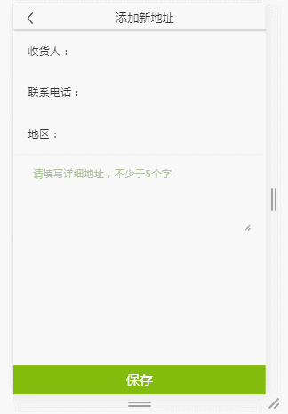

# vue-chinapickarea

# China pickarea component for vue2.0

### 安装插件
npm install vue-chinapickarea

### 在main.js中引入
import Regionpick from 'vue-chinapickarea'
Vue.use(Regionpick)

### 在组件中使用
<regionpick @areaResult="areaResult" v-bind:isshow.sync="show" @notshow="notshow"></regionpick>

### 事件
| 事件名称        | 说明           | 返回值  |
| ------------- |:-------------:| -----:|
| areaResult      | 点击确定时触发 | 地区值返回 |
| notshow      | 点击取消或者空白区域触发 | false |
